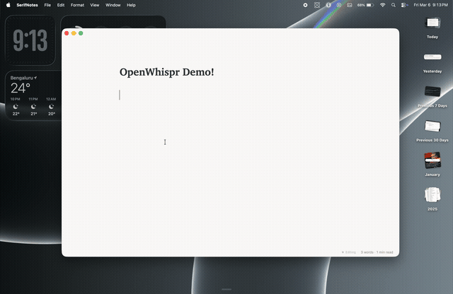

<p align="center">
  
</p>

<h1 align="center">OpenWhispr</h1>

<p align="center">
  Open-source alternative to <a href="https://whisperflow.com">WhisperFlow</a>. Voice-to-text that runs locally on your Mac.
</p>

---

<p align="center">
  
</p>

## What is this

If you've used [WhisperFlow](https://whisperflow.com), you know the experience — hold a key, speak, release, text appears. It's great. But it's closed-source, costs money, and sends your audio to the cloud.

OpenWhispr is the same thing, but open-source and local. Hold Fn, speak, release, text gets pasted wherever your cursor is. Same floating pill UI, same feel. Recording, transcription, polishing, pasting — all happens on your Mac.

It uses [WhisperKit](https://github.com/argmaxinc/WhisperKit) for transcription (runs on Apple Neural Engine) and [Qwen3 0.6B](https://huggingface.co/Qwen/Qwen3-0.6B) for cleaning up grammar and tone. Both run on-device.

## Features

- **Hold Fn** to dictate, release to transcribe and paste
- **Double-tap Fn** to lock recording hands-free
- **Ctrl+Fn** for summarize mode
- **Option+Fn** to ask a question
- **Escape** to cancel
- **Per-app tone** — professional in email, casual in chat, raw in code editors
- **Custom dictionary** — edit a word after dictating and it learns the correction
- **Transcription history** — searchable, stored locally
- **Ctrl+Cmd+V** to re-paste the last transcription

## How it works

1. Hold Fn, it starts recording
2. Voice activity detection strips silence
3. WhisperKit transcribes on the Neural Engine
4. Qwen3 0.6B cleans up grammar, punctuation, and tone
5. Custom dictionary corrections applied as a final pass
6. Text pasted into the focused field via Accessibility API

Takes a couple seconds. Short dictations feel instant.

## Install

### From source

```bash
git clone https://github.com/MrPrinceRawat/OpenWhispr.git
cd OpenWhispr
open OpenWhispr.xcodeproj
```

Build and run in Xcode. Whisper model downloads on first launch (~500MB).

### Download

Pre-built `.dmg` on the [Releases](https://github.com/MrPrinceRawat/OpenWhispr/releases) page.

## Requirements

- macOS 14.0+
- Apple Silicon (M1+)
- Microphone permission
- Accessibility permission (for auto-paste)

## Shortcuts

| Shortcut | Action |
|----------|--------|
| Hold **Fn** | Start dictating |
| Release **Fn** | Stop and paste |
| Double-tap **Fn** | Lock recording |
| **Ctrl+Fn** | Summarize mode |
| **Option+Fn** | Ask a question |
| **Escape** | Cancel |
| **Ctrl+Cmd+V** | Paste last transcription |
| Click menubar icon | Open app window |

## Built with

- Swift, SwiftUI, AppKit
- [WhisperKit](https://github.com/argmaxinc/WhisperKit) — speech recognition
- [SwiftLlama](https://github.com/pgorzelany/swift-llama-cpp) — LLM inference via llama.cpp
- Qwen3 0.6B Q4_K_M — text polishing

## License

Free for personal and non-commercial use. Cannot be sold. See [LICENSE](LICENSE).
